**English** | [简体中文](README.md)

<picture>
  <source media="(max-width: 640px) and (prefers-color-scheme: dark)" srcset="assets/presentation/hero-mobile-dark.svg">
  <source media="(max-width: 640px)" srcset="assets/presentation/hero-mobile-light.svg">
  <source media="(prefers-color-scheme: dark)" srcset="assets/presentation/hero-dark.svg">
  
</picture>

**Record skipped items, reasons, files and sessions in a local ledger so reviewers can decide what needs another pass.**

`v0.2.0` · `Go 1.24+` · [MIT](LICENSE)

[Website](https://omitledger.lei6393.com) · [Demo record](docs/demo-results.json)

## Why use it

During review, completed changes are visible while deliberately omitted work can disappear. OmitLedger lets a caller record the item and stated reason at the time of omission, then use list and reopen to make follow-up review traceable.

## Architecture

<picture>
  <source media="(max-width: 640px) and (prefers-color-scheme: dark)" srcset="assets/presentation/architecture-mobile-dark.svg">
  <source media="(max-width: 640px)" srcset="assets/presentation/architecture-mobile-light.svg">
  <source media="(prefers-color-scheme: dark)" srcset="assets/presentation/architecture-dark.svg">
  
</picture>

The Cobra CLI maps add/list/reopen/report/export to ledger.Store. SQLite stores an Omission’s category, target file, session, status and review note. reopen updates ledger state and appends the record to `.omitledger/reopen.jsonl` for reinjection into the next session; it does not execute omitted work. The mcp command (MCP server + TUI) remains a placeholder.

Source entry points: [cmd/omitledger/root.go](cmd/omitledger/root.go) · [cmd/omitledger/add.go](cmd/omitledger/add.go) · [cmd/omitledger/list.go](cmd/omitledger/list.go) · [cmd/omitledger/reopen.go](cmd/omitledger/reopen.go) · [cmd/omitledger/report.go](cmd/omitledger/report.go) · [cmd/omitledger/export.go](cmd/omitledger/export.go) · [cmd/omitledger/mcp.go](cmd/omitledger/mcp.go) · [internal/ledger/store.go](internal/ledger/store.go)

## Install

Requires Go 1.24+ and uses a pure-Go SQLite driver. The script operates only on a temporary database and does not change the referenced retry.go.

```bash
git clone https://github.com/SuperMarioYL/omitledger.git
cd omitledger
go build -o bin/omitledger ./cmd/omitledger
```

## Quickstart

A complete shell script creates a temporary ledger, records one synthetic omission, lists it, reopens it and lists it again. IDs are generated on each run.

```bash
bash examples/presentation-demo.sh
```

Complete inputs and execution steps are included in the commands above and the [demo record](docs/demo-results.json).

## Usage

```bash
./bin/omitledger init
./bin/omitledger add --item "API example" --reason "deferred for review" --file README.md --category doc
./bin/omitledger list --status open
./bin/omitledger reopen 1 --note "include a complete request"
./bin/omitledger report                        # post-session markdown summary (grouped by category + re-requested list)
./bin/omitledger report --session <id>         # summarize one session only
./bin/omitledger export json > omissions.json  # JSON export for a CI merge-gate
```
`--item` and `--reason` are required. Conventional categories are test/file/section/refactor/doc/log; repository-wide items can use `--file "*"`. reopen accepts a stable ID or the # row number; filtered views (e.g. `--status open`) also number rows by absolute ledger position, so the number shown can be used with reopen directly.

## Recorded demo

<picture>
  <source media="(max-width: 640px) and (prefers-color-scheme: dark)" srcset="assets/presentation/process-mobile-dark.svg">
  <source media="(max-width: 640px)" srcset="assets/presentation/process-mobile-light.svg">
  <source media="(prefers-color-scheme: dark)" srcset="assets/presentation/process-dark.svg">
  
</picture>

### Record and reopen

The same item moves from open to reopened with a note requesting retry-branch coverage.

```text
$ bash examples/presentation-demo.sh
recorded omission 000T0ZPHK7EB5WN6SCHAH9546H
  item:     retry-path test
  file:     retry.go
  category: test
  reason:   deferred during initial implementation
  session:  presentation-demo
#  ID                          STATUS  CATEGORY  FILE      ITEM             REASON
1  000T0ZPHK7EB5WN6SCHAH9546H  open    test      retry.go  retry-path test  deferred during initial implementation

1 omission(s)
reopened 000T0ZPHK7EB5WN6SCHAH9546H: retry-path test
  note: cover the retry branch
#  ID                          STATUS    CATEGORY  FILE      ITEM             REASON
1  000T0ZPHK7EB5WN6SCHAH9546H  reopened  test      retry.go  retry-path test  deferred during initial implementation

1 omission(s)
```

## Capabilities and integration

<picture>
  <source media="(max-width: 640px) and (prefers-color-scheme: dark)" srcset="assets/presentation/integrations-mobile-dark.svg">
  <source media="(max-width: 640px)" srcset="assets/presentation/integrations-mobile-light.svg">
  <source media="(prefers-color-scheme: dark)" srcset="assets/presentation/integrations-dark.svg">
  
</picture>

Workflows can explicitly call the CLI or use the supplied skill snippet as guidance. Recording is cooperative: it does not infer omissions from code or decide whether a reason is justified.


## Configuration

Ledger location precedence is `--store` > `OMITLEDGER_STORE` > `.omitledger/ledger.db` (a leading `~/` is expanded). Session precedence is `OMITLEDGER_SESSION`, CLAUDE_SESSION_ID, CURSOR_SESSION_ID, then local. SQLite uses WAL and a 5000ms busy timeout. Every reopen appends one JSON re-request event to `.omitledger/reopen.jsonl` in the ledger directory (append-only); the skill snippet reads it at the start of the next session and re-requests the listed items.

## Roadmap and scope

Current usable entry points are init/add/list/reopen/report/export, and reopen reinjects into the next session via `.omitledger/reopen.jsonl`. The MCP server, the TUI viewer and team aggregation are still unwired; internal modules alone do not establish CLI support.

- Records are caller statements: missing entries do not establish absence of omissions, and reopened does not mean completed.
- The mcp placeholder can exit successfully without providing the described full functionality.

 · [Recording script](docs/demo.tape)

## License

[MIT](LICENSE)
