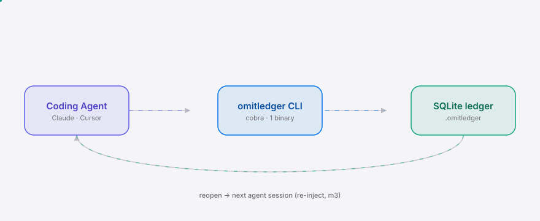
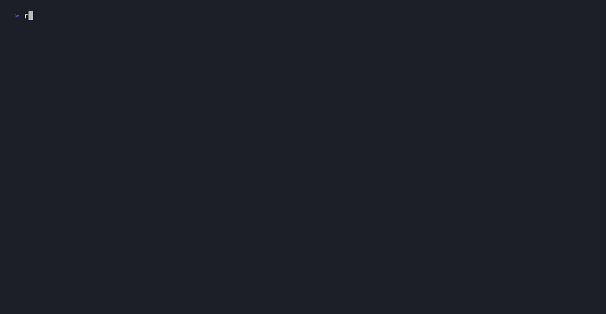

<div align="right"><sub>[English](./README.en.md)&nbsp;&nbsp;⇄&nbsp;&nbsp;<b>简体中文</b></sub></div>

<picture>
  <source media="(prefers-color-scheme: dark)" srcset="./assets/hero-dark.svg">
  <source media="(prefers-color-scheme: light)" srcset="./assets/hero-light.svg">
  
</picture>

<p align="center"><sub>OmitLedger 记录编码 Agent 刻意省略的每一项与原因，让合理省略与偷工减料一眼可分。</sub></p>

<p align="center">
  <a href="./LICENSE"></a>
  <a href="https://github.com/SuperMarioYL/omitledger/releases"></a>
  
  
</p>

**当 Agent 学会偷懒，它省略的每一项都该留下记录。**

<h2> 架构</h2>

<picture>
  <source media="(prefers-color-scheme: dark)" srcset="./assets/atlas-dark.svg">
  <source media="(prefers-color-scheme: light)" srcset="./assets/atlas-light.svg">
  
</picture>

一个二进制，一个本地 DB 文件。编码 Agent 在决定省略的那一刻调用 `omitledger add` 记下被跳过的事项、自述的理由与目标文件；`omitledger list` 把整本台账摊开；`omitledger reopen` 把可疑的那一条标为「需要重做」。v0.1 无网络、无服务进程——所有数据停留在你仓库的 `.omitledger/ledger.db`。

## 目录

- [为什么需要](#为什么需要)
- [安装](#安装)
- [快速开始](#快速开始)
- [用法](#用法)
- [Demo](#demo)
- [配置](#配置)
- [付费](#付费)
- [路线图](#路线图)
- [许可证](#许可证)

## 为什么需要

2026 年，让 Agent「刻意少做」已成主流——[ponytail](https://github.com/DietrichGebert/ponytail)（10 万+ star）让 Agent 像最懒的资深工程师一样思考，[taste-skill](https://github.com/Leonxlnx/taste-skill)（7.6 万+ star）主动压制泛泛的 slop。两者都制造了大量「未被产出的事项」，却都不为每一次省略留下记录。于是当一个「偷懒」的 Agent 给你的比预期少，你无法分辨它究竟是审慎地最小化，还是偷偷砍了一个角——只能拿输出和脑子里那份「完整」的预期做 diff。

OmitLedger 在 Agent 决策那一刻记下被刻意跳过的事项、Agent 自述的理由与一键重做按钮。这份「省略资产」是新的原语：区别于任何让 Agent 变懒的最小化引擎，它把省略变成可查询、可重做、可审计的记录，让合理省略与偷工减料一眼可分。

<h2> 安装</h2>

需要 Go 1.24+。单二进制，纯 Go SQLite 驱动（无 cgo → 一个静态二进制）：

```bash
go install github.com/SuperMarioYL/omitledger@latest
```

<h2> 快速开始</h2>

冷启动到首个可见结果，三步：

```bash
omitledger init                                          # 在仓库根创建 .omitledger/ledger.db
omitledger add --item "parser unit test" \
  --reason "trivial getter, low risk" --file parser.go --category test
omitledger list                                      # 看到刚记下的一条
```

<details><summary>样例输出</summary>

```
$ omitledger init
omitledger ledger ready: /your-repo/.omitledger/ledger.db
  0 omission(s) recorded, 0 open
Next: install the agent skill ...
  mkdir -p ~/.claude/skills/omit-ledger && cp skills/omit-ledger/SKILL.md ~/.claude/skills/omit-ledger/SKILL.md

$ omitledger add --item "parser unit test" --reason "trivial getter, low risk" --file parser.go --category test
recorded omission 000T02CDSCFS5XYTBBFE9DSQNT
  item:     parser unit test
  file:     parser.go
  category: test
  reason:   trivial getter, low risk
  session:  local

$ omitledger list
#  ID                          STATUS  CATEGORY  FILE       ITEM                REASON
1  000T02CDSCFS5XYTBBFE9DSQNT  open    test      parser.go  parser unit test    trivial getter, low risk
```
</details>

<h2> 用法</h2>

让 Agent 自己记录省略——把 `skills/omit-ledger/SKILL.md` 装进 Agent 的技能目录，它就会在刻意省略时自动调用 `omitledger add`：

```bash
mkdir -p ~/.claude/skills/omit-ledger && cp skills/omit-ledger/SKILL.md ~/.claude/skills/omit-ledger/SKILL.md
```

5 个最常见的工作流：

```bash
# 1) 记一条省略（Agent 在决策那一刻调用）
omitledger add --item "retry-path error log" --reason "rare branch, deferred to follow-up" --file retry.go --category log

# 2) 看整本台账
omitledger list

# 3) 只看仍 open 的（待你复核）
omitledger list --status open

# 4) 重做某一条：按 # 列行号，或按 ULID
omitledger reopen 1 --note "needs the test"

# 5) m2/m3 留位（m1 尚未实现）
omitledger mcp      # MCP server 模式 + TUI 查看器（m2）
omitledger report   # 会话后报告 + 重新注入 + JSON 导出（m3）
```

`--category` 取值：`test | file | section | refactor | doc | log`。`--file` 是目标路径，仓库级省略用 `*`。

<h2> Demo</h2>

`init` → Agent 刻意省略两项 → `list` → `reopen 1` → `list`（状态翻成 reopened）：



> 录制脚本见 [`docs/demo.tape`](./docs/demo.tape)（[vhs](https://github.com/charmbracelet/vhs)）；`.github/workflows/demo.yml` 可手动重渲染为 `assets/demo.gif`。

<h2> 配置</h2>

OmitLedger 无配置文件——行为由标志位与环境变量控制：

| 键 | 类型 | 默认 | 含义 |
|---|---|---|---|
| `--store` | 路径 | `.omitledger/ledger.db` | 台账 DB 位置；`OMITLEDGER_STORE` 环境变量同效，可用 `~/.omitledger/ledger.db` 做全局台账 |
| `OMITLEDGER_SESSION` | 字符串 | `local` | Agent 运行 id，盖戳在每条省略上；缺省时回退 `CLAUDE_SESSION_ID` / `CURSOR_SESSION_ID` |
| `.omitledger/ledger.db` | 文件 | （仓库本地） | 纯 Go SQLite 台账；WAL + `busy_timeout=5000` |

<h2> 付费</h2>

CLI 永久免费开源。面向 5–30 人工程团队（受监管的金融科技 / 医疗 / 安全团队尤甚，一个被跳过的测试就能打挂生产）的 **team tier** 是 v0.2 的付费层：

- **聚合每位成员的本地 ledger** 为团队视图；
- **按 PR 暴露未复核的省略**；
- 当未复核省略超过阈值时发出 **merge-block webhook**（CI gate）——「可审计的省略资产」是团队为之付费的部分，CLI 始终免费。

价格 **$8 / dev-seat / 月**，10 席起 **$49 / 月**，超出按 $8 / 席。落在 CI 插件与 CodeRabbit 级 review（~$15/席）之间，由更窄的省略审计面支撑。v0.1 **不含任何付费功能**——这是路线图钩子，不是付费墙。注册 Stripe Trusted Publisher 与 Fly.io 托管聚合服务是 v0.2 的一次性步骤。

<h2> 路线图</h2>

- [x] **m1 — 记录与列表**：`init` / `add` / `list` / `reopen` CLI + 纯 Go SQLite 台账 + Agent 技能片段（本版本）
- [ ] **m2 — MCP 与 TUI**：`omitledger mcp` 经 stdio 暴露原生 MCP 工具（`record_omission` / `list_omissions` / `reopen_omission`），`omitledger tui` 提供光标可选择的交互查看器
- [ ] **m3 — 报告与重注入**：`omitledger report` 输出按类别分组的会话后 markdown 摘要；`reopen` 写入 `.omitledger/reopen.jsonl` 在下一会话重新注入；`omitledger export json` 喂给 CI merge-gate
- [ ] **team tier（商业，v0.2）**：聚合成员 ledger、按 PR 暴露未复核省略、merge-block webhook

<h2> 许可证</h2>

MIT — 见 [LICENSE](./LICENSE)。提 issue 或 PR 欢迎。

<p align="center"><sub><a href="./LICENSE">MIT</a> © 2026 SuperMarioYL</sub></p>
